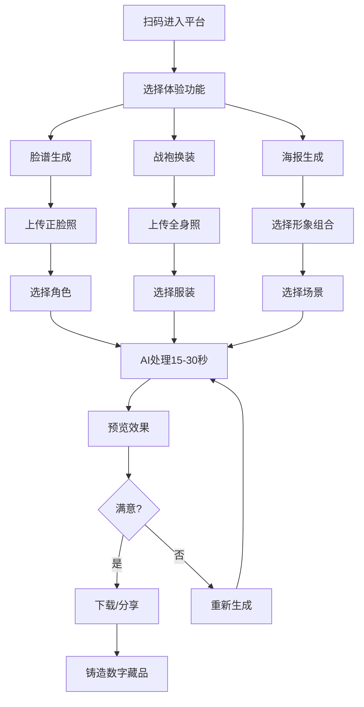

# AI英歌舞生成式体验平台 - 产品需求文档

## 1. 产品概述

**产品名称**：英歌幻境 · AI数字英歌舞剧场

让用户上传照片或简单动作，AI生成该用户化身英歌舞表演者的专属视频/形象，让每个人都能「跳」起非遗英歌舞。

- 主要目的：将广东潮汕传统非遗英歌舞通过AI技术数字化，让更多人体验和传播这一传统文化
- 目标用户：对传统文化感兴趣的年轻用户、潮汕文化爱好者、短视频分享者
- 市场价值：非遗数字化保护、低门槛文化传播、跨境文化输出

## 2. 核心功能

### 2.1 功能模块（按优先级）

#### MVP核心功能（第一阶段）
1. **英歌舞脸谱生成**：上传正脸照片，AI生成用户身着英歌舞脸谱妆容的形象照
2. **英歌舞战袍换装**：上传全身照，AI生成用户身着英歌舞传统戏服的形象
3. **英歌舞海报生成**：融合脸谱+战袍+动态背景，生成个人英歌舞海报

#### 扩展功能（第二阶段）
4. **照片转视频**：上传照片生成15-20秒英歌舞表演视频
5. **动作驱动**：用户拍3-5秒简单动作，映射为完整英歌舞表演
6. **数字藏品铸造**：将生成的形象铸造成专属数字藏品

### 2.2 页面详情

| 页面名称 | 模块名称 | 功能说明 |
|---------|---------|---------|
| 首页 | Hero区域 | 展示平台核心价值主张，吸引用户开始体验 |
| 首页 | 功能入口 | 三个核心功能入口（脸谱生成/战袍换装/海报生成） |
| 首页 | 作品展示 | 展示用户生成的优秀作品，激发创作欲望 |
| 脸谱生成页 | 照片上传 | 支持拖拽上传，点击选择正脸照片 |
| 脸谱生成页 | 角色选择 | 选择英歌舞角色（关公/张飞/林冲等） |
| 脸谱生成页 | AI生成 | 调用AI生成脸谱妆容形象 |
| 脸谱生成页 | 预览下载 | 预览生成结果，支持下载和分享 |
| 战袍换装页 | 照片上传 | 上传全身或半身照片 |
| 战袍换装页 | 服装选择 | 选择英歌舞服装样式（红/黄色调） |
| 战袍换装页 | AI生成 | 生成换装形象 |
| 海报生成页 | 组合选择 | 脸谱+战袍+背景场景选择 |
| 海报生成页 | AI生成 | 生成完整海报 |
| 个人中心 | 我的作品 | 展示历史生成作品 |
| 个人中心 | 数字藏品 | 展示铸造的数字藏品 |

## 3. 核心流程

### 3.1 脸谱生成流程
```
用户进入 → 选择脸谱功能 → 上传正脸照 → 选择角色 → AI生成(15-30秒) → 预览效果 → 下载/分享
```

### 3.2 战袍换装流程
```
用户进入 → 选择换装功能 → 上传全身照 → 选择服装风格 → AI生成(15-30秒) → 预览效果 → 下载/分享
```

### 3.3 海报生成流程
```
用户进入 → 选择海报功能 → 选择脸谱形象 → 选择服装 → 选择背景场景 → AI生成 → 预览下载
```

### 3.4 流程图


## 4. 用户界面设计

### 4.1 设计风格
- **整体定位**：国潮风格 × 科技感，数字艺术 × 传统非遗的碰撞
- **主色调**：英歌红 #C41E3A（中国红）、金色 #D4AF37（传统金）
- **辅助色**：深蓝 #1A1A2E（科技夜空）、象牙白 #FFFFF0（传统底色）
- **字体选择**：
  - 主标题：思源宋体（传统感）
  - 正文：思源黑体（现代感）
  - 装饰文字：方正古隶（书法感）
- **按钮风格**：圆角矩形，悬停有光晕效果，渐变色彩
- **布局风格**：卡片式布局，大量留白，视觉焦点突出
- **图标风格**：线性图标，颜色与主色调统一

### 4.2 页面设计概览

| 页面名称 | 模块名称 | UI元素描述 |
|---------|---------|-----------|
| 首页 | Hero区域 | 全屏背景（英歌舞巡游场景），中央标题"英歌幻境"，副标题"让每个人都能跳起非遗英歌舞"，底部"开始体验"按钮 |
| 首页 | 功能入口 | 三个大卡片并排，每个卡片包含：图标、标题、功能描述，悬停有红色边框光晕 |
| 首页 | 作品展示 | 瀑布流布局，展示用户生成的作品缩略图，点击可查看大图 |
| 脸谱生成页 | 上传区 | 虚线边框拖拽区域，支持点击上传，预览已上传图片 |
| 脸谱生成页 | 角色选择 | 角色卡片网格，每个角色有缩略图和名称，已选中状态有金色边框 |
| 脸谱生成页 | 生成区 | 生成按钮（大红色），加载动画（英歌舞动作剪影旋转），生成结果展示 |

### 4.3 响应式设计
- **桌面优先**：1200px以上为桌面布局
- **平板适配**：768px-1200px，调整为两列布局
- **手机适配**：768px以下，单列布局，功能入口垂直排列
- **触摸优化**：按钮最小点击区域48x48px，输入框高度48px

### 4.4 动画效果
- **页面加载**：元素依次淡入（stagger animation，间隔100ms）
- **悬停效果**：卡片轻微上浮（translateY: -8px），阴影加深
- **按钮点击**：缩放0.95，0.1s后恢复
- **图片生成**：中心旋转加载动画，配合进度文字
- **分享成功**：弹出成功提示，带有节日烟花效果（可选）

## 5. 技术约束

### 5.1 前端技术栈
- React 18 + TypeScript
- Tailwind CSS 3
- Vite 构建工具
- 状态管理：Zustand

### 5.2 AI集成（MVP阶段）
- 图像生成：集成Stable Diffusion API / Midjourney API
- 图像处理：前端Canvas / WebGL优化
- 预计API调用：生成质量优化后端处理

### 5.3 性能要求
- 首屏加载时间：< 3秒
- 图片生成时间：15-30秒（显示进度）
- 页面切换：< 0.5秒

### 5.4 浏览器兼容性
- Chrome 90+
- Firefox 88+
- Safari 14+
- Edge 90+

## 6. MVP版本范围

### 必须完成（MVP）
- 首页设计和开发
- 脸谱生成功能（上传→选择角色→生成→预览下载）
- 战袍换装功能（上传→选择服装→生成→预览下载）
- 响应式布局适配
- 基础错误处理和加载状态

### 可延后（第二版）
- 海报生成功能
- 视频生成功能
- 动作驱动功能
- 数字藏品铸造
- 用户登录/个人中心
