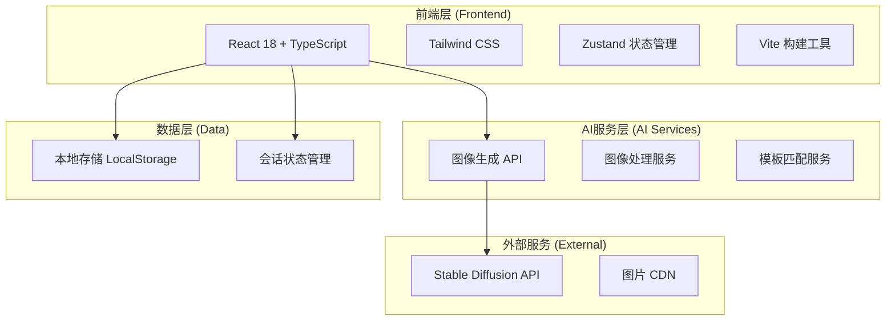

# AI英歌舞生成式体验平台 - 技术架构文档

## 1. 架构设计

### 1.1 整体架构图



## 2. 技术选型说明

### 2.1 前端技术栈
- **React 18**: 成熟的组件化框架，生态丰富
- **TypeScript**: 类型安全，提高代码质量
- **Tailwind CSS 3**: 原子化CSS，快速开发响应式界面
- **Vite**: 快速的开发服务器和构建工具
- **Zustand**: 轻量级状态管理，比Redux更简单

### 2.2 项目初始化
使用模板：`react-ts`（纯前端项目，MVP阶段不需要后端）

## 3. 路由定义

| 路由路径 | 页面名称 | 功能描述 |
|---------|---------|---------|
| / | 首页 | Hero区域、功能入口、作品展示 |
| /face-generator | 脸谱生成页 | 脸谱妆容生成完整流程 |
| /costume-changer | 战袍换装页 | 服装换装生成完整流程 |
| /poster-generator | 海报生成页 | 组合海报生成（第二版） |
| /gallery | 作品展示页 | 用户生成作品画廊 |

## 4. 核心组件结构

```
src/
├── components/
│   ├── layout/
│   │   ├── Header.tsx          # 顶部导航
│   │   └── Footer.tsx         # 底部信息
│   ├── home/
│   │   ├── HeroSection.tsx    # Hero区域
│   │   ├── FeatureCards.tsx   # 功能入口卡片
│   │   └── GalleryPreview.tsx # 作品预览
│   ├── generator/
│   │   ├── UploadZone.tsx     # 图片上传区域
│   │   ├── CharacterSelect.tsx # 角色选择器
│   │   ├── CostumeSelect.tsx  # 服装选择器
│   │   ├── GenerateButton.tsx # 生成按钮
│   │   ├── LoadingAnimation.tsx # 加载动画
│   │   └── ResultPreview.tsx  # 结果预览
│   └── common/
│       ├── Button.tsx         # 通用按钮
│       ├── Card.tsx           # 通用卡片
│       └── Modal.tsx          # 通用弹窗
├── pages/
│   ├── Home.tsx               # 首页
│   ├── FaceGenerator.tsx      # 脸谱生成页
│   ├── CostumeChanger.tsx    # 战袍换装页
│   └── Gallery.tsx            # 作品展示页
├── stores/
│   ├── useGeneratorStore.ts   # 生成器状态管理
│   └── useGalleryStore.ts     # 作品库状态管理
├── hooks/
│   ├── useImageUpload.ts      # 图片上传Hook
│   └── useGenerator.ts        # AI生成Hook
├── services/
│   └── api.ts                 # API调用服务
├── types/
│   └── index.ts               # TypeScript类型定义
└── utils/
    └── helpers.ts             # 工具函数
```

## 5. 状态管理设计

### 5.1 生成器状态（useGeneratorStore）
```typescript
interface GeneratorState {
  // 上传的图片
  uploadedImage: string | null;
  // 选择的角色/服装
  selectedOption: string;
  // 生成状态
  isGenerating: boolean;
  // 生成的图片
  generatedImage: string | null;
  // 错误信息
  error: string | null;
}
```

### 5.2 作品库状态（useGalleryStore）
```typescript
interface GalleryState {
  // 我的作品列表
  myWorks: GeneratedWork[];
  // 添加作品
  addWork: (work: GeneratedWork) => void;
  // 删除作品
  removeWork: (id: string) => void;
}
```

## 6. API接口设计（MVP阶段）

### 6.1 图像生成接口
```typescript
// POST /api/generate/face
interface FaceGenerateRequest {
  image: string;        // Base64编码的图片
  character: string;    // 角色ID
}

interface FaceGenerateResponse {
  success: boolean;
  image?: string;       // 生成的图片Base64
  error?: string;
}

// POST /api/generate/costume
interface CostumeGenerateRequest {
  image: string;        // Base64编码的图片
  costume: string;      // 服装ID
}

interface CostumeGenerateResponse {
  success: boolean;
  image?: string;
  error?: string;
}
```

## 7. 数据模型

### 7.1 生成作品模型
```typescript
interface GeneratedWork {
  id: string;           // 唯一ID
  type: 'face' | 'costume' | 'poster'; // 类型
  originalImage: string; // 原图
  generatedImage: string; // 生成图
  option: string;        // 选择的角色/服装
  createdAt: number;     // 创建时间戳
}
```

## 8. 关键实现细节

### 8.1 图片上传
- 使用FileReader读取图片
- 限制图片大小：最大5MB
- 支持格式：JPG, PNG, WEBP
- 前端压缩：使用canvas压缩到合适尺寸

### 8.2 AI生成流程（MVP）
1. 前端上传图片和选项到API
2. 后端调用AI图像生成服务
3. 返回生成结果
4. 前端展示结果

### 8.3 本地存储策略
- 作品数据：LocalStorage（最多存储20个作品）
- 用户偏好：LocalStorage
- 临时数据：Zustand内存状态

## 9. 性能优化策略

### 9.1 首屏加载优化
- 代码分割：动态导入非首屏组件
- 图片懒加载：使用loading="lazy"
- 资源压缩：Vite生产构建自动压缩

### 9.2 生成体验优化
- 进度反馈：显示生成进度百分比
- 预生成预览：先生成低分辨率预览
- 防抖处理：防止用户重复点击生成

## 10. 错误处理机制

### 10.1 网络错误
- 自动重试：最多重试3次
- 错误提示：友好的中文错误提示
- 离线检测：提示用户检查网络

### 10.2 生成失败
- 失败原因分类：网络/服务器/AI模型
- 重试按钮：失败后提供重新生成选项
- 备选方案：提供预设图片选择

## 11. 开发规范

### 11.1 代码规范
- 组件文件不超过200行
- 使用TypeScript严格模式
- 统一的代码格式化（Prettier）
- 组件命名：PascalCase

### 11.2 Git提交规范
- feat: 新功能
- fix: 修复bug
- docs: 文档更新
- style: 代码格式
- refactor: 重构

## 12. 测试策略

### 12.1 单元测试
- 工具：Vitest
- 覆盖率：核心工具函数100%

### 12.2 集成测试
- 关键用户流程测试
- AI生成流程测试

### 12.3 手动测试清单
- [ ] 各页面加载正常
- [ ] 图片上传功能正常
- [ ] 角色/服装选择正常
- [ ] 生成按钮响应正常
- [ ] 结果预览和下载正常
- [ ] 响应式布局正常
- [ ] 移动端触摸交互正常
