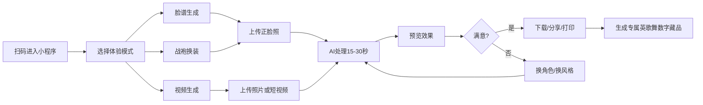

## 🤖 Assistant

<div style="border: 2px solid #dddddd; border-radius: 10px;">
  <details style="padding: 5px;">
    <summary>已深度思考</summary>
    The user wants me to develop an idea for a generative experience where users upload photos or simple actions, and AI generates a customized Yingge Dance (英歌舞) performance video or image. They want me to expand on this idea and generate a professional prompt.<br><br>Let me think about this systematically. Yingge Dance (英歌舞) is a traditional folk dance from the Chaoshan region of Guangdong, China. It's known for its vigorous, martial-arts-like movements, colorful costumes, and face painting. It's often performed during festivals and is considered a form of "Chinese street dance" or "warrior dance."<br><br>Let me develop this idea comprehensively using the CO-STAR framework I just learned, then generate a professional prompt.<br><br>I need to think about:<br>1. What exactly the product/experience does<br>2. The technical components<br>3. The user flow<br>4. The AI prompt structure for generating Yingge Dance content<br><br>The user wants me to:<br>1. 展开想法 (expand the idea)<br>2. 补充更多内容 (add more content)<br>3. 生成专业的提示词 (generate professional prompts)<br><br>Let me create a comprehensive development plan with professional prompts.
  </details>
</div>

好的，先让我系统展开这个创意，再生成专业提示词。

---

## 🎭 创意展开：AI英歌舞生成式体验平台

### 一、产品概念定位

**产品名称建议**：英歌幻境 · AI数字英歌舞剧场

**一句话定义**：用户上传一张照片或一段简单动作视频，AI即可生成该用户化身英歌舞表演者的专属视频/形象，让每个人都能「跳」起非遗英歌舞。

---

### 二、核心功能矩阵

#### 功能层级一：静态形象生成
| 子功能 | 说明 |
|--------|------|
| **英歌脸谱生成** | 上传正脸照片，AI根据用户面部特征生成英歌舞专属脸谱妆容（关公、张飞、林冲等角色脸谱） |
| **英歌战袍换装** | 上传全身照，AI生成用户身着英歌舞传统戏服（靠旗、战裙、头饰）的形象 |
| **英歌海报生成** | 融合脸谱+战袍+动态英歌舞背景，生成电影级个人英歌舞海报 |
| **双人/多人英歌对决图** | 两用户上传照片，生成英歌舞「对打」场景，还原梁山好汉对战 |

#### 功能层级二：动态视频生成
| 子功能 | 说明 |
|--------|------|
| **照片转英歌舞视频** | 上传一张照片，AI生成该人物表演英歌舞的短视频（15-30秒） |
| **动作驱动英歌舞** | 用户拍一段简单动作（如挥臂、转圈、跺脚），AI将其映射为标准英歌舞动作序列 |
| **英歌舞名场面复刻** | 用户选择经典英歌舞片段（如「双槌对打」「群英开道」），AI将用户形象植入该场景 |
| **AI编舞模式** | 用户选择音乐节奏+英歌舞流派（快板/慢板/中板），AI自动编排一段新英歌舞 |

#### 功能层级三：互动体验
| 子功能 | 说明 |
|--------|------|
| **英歌舞教学评分** | 用户模仿英歌舞动作录视频，AI对比标准动作给出评分和改进建议 |
| **英歌舞巡游生成** | 上传多张照片生成一支「AI英歌队」，配合锣鼓音乐生成巡游视频 |
| **方言祝福彩蛋** | 视频中嵌入用户用潮汕方言说祝福语的语音克隆彩蛋 |

---

### 三、技术链路拆解

```
用户输入层
├── 静态照片（正脸/全身/半身）
├── 短视频（简单动作）
└── 文本选择（角色、流派、场景）

AI处理层
├── 人脸检测与特征提取（MediaPipe / InsightFace）
├── 骨骼关键点提取与动作识别
├── 英歌舞动作库匹配与重定向
├── 服饰/脸谱风格迁移（Stable Diffusion + ControlNet / IP-Adapter）
├── 视频生成（AnimateDiff / SVD / 可灵 / Runway Gen-3）
└── 语音克隆 + 口型同步（可选）

输出层
├── 高清形象照（2K/4K）
├── 15-30秒表演视频
├── 英歌舞海报（可分享到朋友圈/小红书）
└── 动态表情包/GIF
```

---

### 四、用户旅程设计



---

### 五、商业化路径（补充）

1. **免费体验**：每天1次基础脸谱生成
2. **付费解锁**：
 - 高清视频下载（¥9.9/次）
 - 英歌舞数字藏品铸造（¥29.9）
 - 多人英歌队生成（¥19.9）
3. **B端合作**：
 - 景区线下打卡机（游客扫码即可生成英歌舞打卡视频）
 - 非遗文化进校园（学校批量采购作为传统文化课程体验工具）
 - 潮汕侨乡文化节官方合作

---

### 六、文化价值延伸

- **非遗数字化保护**：英歌舞动作数据库建设，用AI记录和传承标准动作
- **低门槛传播**：让不会跳英歌舞的年轻人也能「穿上」英歌战袍，激发对传统文化的兴趣
- **跨境传播**：海外潮汕侨胞通过AI生成思乡主题英歌舞视频

---

现在，我用刚学习的 **CO-STAR 框架**，生成针对该产品的专业AI提示词：

---

## 🎯 专业提示词（CO-STAR格式）

### 【提示词一】英歌舞脸谱妆容生成

```
# CONTEXT #
你是一位精通中国传统戏曲脸谱艺术和AI图像生成的专家。英歌舞（Yingge Dance）是广东潮汕地区的传统民间舞蹈，表演者需画脸谱妆容，角色多取自《水浒传》梁山好汉，如水浒三十六天罡人物。不同角色脸谱有不同的色彩含义和图案特征：红脸代表忠勇（如关公），黑脸代表刚正（如张飞），白脸代表奸诈，花脸代表勇猛。脸谱需保留用户的面部特征（五官结构、脸型），同时融入英歌舞脸谱的绘画风格。

# OBJECTIVE #
根据用户上传的正面照片和选择的英歌舞角色，生成一张该用户画上对应英歌舞脸谱妆容的高清形象照。要求妆容融合真人面部特征与英歌舞传统脸谱艺术，效果逼真自然、色彩饱满，适合社交分享和打印。

# STYLE #
- 介于写实摄影与传统工笔画之间的质感
- 脸谱线条清晰有力，色彩浓郁
- 用户本人五官清晰可辨，不能变成另一个人
- 背景为纯色深色渐变，突显脸谱主体
- 光影柔和，面部立体感强

# TONE #
英武、庄重、具有仪式感

# AUDIENCE #
对传统文化感兴趣的年轻用户、潮汕文化爱好者、社交媒体分享者

# RESPONSE #
请生成生成该图像的详细Stable Diffusion提示词（英文），需包含：
1. 角色脸谱描述（色彩、图案特征）
2. 用户特征保留关键词（如photorealistic face, recognizable facial features, identity preservation）
3. 画质关键词（如8K, highly detailed, professional lighting）
4. 负向提示词（如避免的内容）
5. 推荐模型、ControlNet配置、IP-Adapter权重等参数建议
```

---

### 【提示词二】英歌舞表演视频生成（照片驱动）

```
# CONTEXT #
你是一位AI视频生成与数字人动画专家。英歌舞是中国国家级非物质文化遗产，表演以刚劲有力的动作为核心：双手各持英歌槌（短木棒），配合锣鼓节奏做出「劈、扫、挑、打」等武术化动作，步伐以「马步」「弓步」「跳跃」为主，整体风格威武豪迈。现有一个AI系统，用户上传一张全身或半身照片，系统需基于该照片生成一段15-20秒的英歌舞表演短视频。

# OBJECTIVE #
设计一套完整的AI视频生成工作流提示词，将用户静态照片转化为一段该用户化身的英歌舞表演视频。需要满足以下要求：
1. 人物面部与体型特征与原始照片高度一致
2. 人物自动穿上英歌舞战袍（红色或黄色为主色调，带靠旗、头饰）
3. 动作流畅有力，包含至少3个英歌舞标志性动作
4. 背景为英歌舞巡游场景（潮汕传统建筑或节日庆典氛围）
5. 视频配有英歌舞锣鼓音乐节奏

# STYLE #
- 电影级画质，动态运镜
- 色彩饱满，富有节庆气息
- 动作刚劲利落，节奏感强
- 保留用户面部恒定性，零跳变

# TONE #
热血、震撼、国潮风尚

# AUDIENCE #
短视频平台用户（抖音/小红书/视频号）、非遗文化爱好者、潮汕侨胞

# RESPONSE #
请输出：
1. 完整的视频生成工作流描述（从照片到成品视频的技术链路）
2. 每一步骤的具体AI提示词（中英文双语）
3. 关键参数建议（帧率、分辨率、动作强度等）
4. 常见失败模式及规避策略（如面部变形、动作僵硬、服装穿模等）
5. 推荐的AI工具组合方案（如可灵Kling + Runway Gen-3 + AnimateDiff等）
```

---

### 【提示词三】动作驱动英歌舞（用户简单动作→英歌舞动作映射）

```
# CONTEXT #
你是一位计算机视觉与人机交互专家。当前产品功能为：用户用手机拍摄3-5秒的简单动作（如挥动右手、向前跨一步、身体转一圈等），AI系统将该动作识别后，映射扩展为一段完整的英歌舞表演动作序列，并生成该用户的英歌舞表演视频。

技术原理参考：
- 用 MediaPipe 或 OpenPose 从用户视频中提取骨骼关键点
- 将用户动作特征（方向、幅度、速度）与英歌舞动作模板库匹配
- 选取最匹配的英歌舞动作片段（如「横扫千军」「力劈华山」「回马枪」等）
- 用动作重定向技术驱动用户化身执行完整英歌舞序列
- 最终渲染为视频输出

# OBJECTIVE #
设计该功能的完整技术方案与AI提示词体系，使用户仅需3-5秒简单动作输入，即可生成15-20秒的专业英歌舞表演视频。

# STYLE #
- 动作映射自然，过度流畅
- 英歌舞动作保真度高
- 用户化身与动作无缝融合

# TONE #
酷炫、互动感强、科技赋能传统

# AUDIENCE #
普通用户（零舞蹈基础）、英歌舞初学者、互动体验者

# RESPONSE #
请输出：
1. 完整技术架构图（文字描述）
2. 英歌舞动作模板库的建立方案（需包含至少10个经典动作名称与描述）
3. 动作匹配算法的决策逻辑
4. 视频生成步骤的AI提示词（每步骤详细说明）
5. 用户体验优化建议（如动作引导UI文案、拍摄姿势示范图描述）
6. 异常处理策略（如用户动作无法识别时的fallback方案）
```

---

### 【提示词四】英歌舞数字藏品铸造（附加价值）

```
# CONTEXT #
你是一位数字藏品（NFT）与AI艺术生成专家。用户在上一个环节已经生成了自己的英歌舞表演视频或形象照，现在系统需要将其铸造成一份专属数字藏品，包含动态效果、唯一编号、区块链存证。该数字藏品将作为用户「非遗英歌舞数字传承人」的身份凭证。

# OBJECTIVE #
设计英歌舞数字藏品的视觉呈现方案和生成提示词。数字藏品应包含：
1. 用户的英歌舞形象（动态或静态）
2. 专属编号与铸造日期
3. 潮汕文化元素装饰（如潮绣纹样、潮州木雕边框）
4. 区块链证书信息展示
5. 可分享至社交平台的预览图

# STYLE #
- 数字艺术 × 传统非遗的碰撞风格
- 金属质感 + 传统纹样镶边
- 科技蓝与英歌红的主色调对比

# TONE #
珍藏感、尊贵感、文化传承使命感

# AUDIENCE #
数字藏品收藏者、潮汕文化海外侨胞、非遗数字化关注者

# RESPONSE #
请输出：
1. 数字藏品卡面设计的视觉描述
2. AI生成该卡面的详细提示词
3. 动态效果设计建议
4. 社交分享卡片的最佳尺寸与布局方案
5. 数字藏品命名与描述的文案模板
```

---

以上就是完整的创意展开和四组专业提示词，覆盖形象生成、视频生成、动作驱动、数字藏品四个核心场景。这套设计可直接拆解为产品PRD、开发任务和AI模型选型参考。
